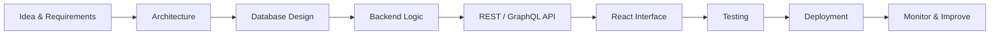

<p align="center">
  
</p>

<p align="center">
  <a href="https://readme-typing-svg.demolab.com">
    
  </a>
</p>

<p align="center">
  <a href="mailto:robiulislam31122002@gmail.com">
    
  </a>
</p>

---

## 👨‍💻 About Me

```javascript
const robiul = {
  role: "Full-Stack Developer",
  background: "Computer Science",
  approach: "End-to-end application development",

  languages: ["JavaScript", "Python", "C++", "C"],
  frontend: ["React", "Responsive UI", "Cross-Platform Concepts"],
  backend: ["Node.js", "Express.js", "REST API", "GraphQL"],
  databases: ["SQL", "NoSQL", "MongoDB", "PostgreSQL"],
  services: ["Supabase", "Firebase", "Authentication"],
  tools: ["Git", "GitHub", "Postman", "Version Control"],

  mindset: ["Build", "Learn", "Optimize", "Solve"],
  currentFocus: [
    "Scalable application design",
    "Clean architecture",
    "Advanced React",
    "Backend engineering",
    "AI integration"
  ]
};
```

I enjoy building **complete, database-driven applications**, not only one layer of a product. I like understanding how the full system connects, from requirements and architecture to backend logic, APIs, authentication, frontend interfaces, deployment, and version control.

> **Development philosophy:** Do not just learn the technology. Understand how it fits into the system.

```text
Problem → Architecture → Logic → Data → API → Interface → Performance
```

---

## 🧠 Engineering Focus

<table>
  <tr>
    <td width="50%" valign="top">
      <h3>🌐 Full-Stack Development</h3>
      <ul>
        <li>Responsive React interfaces</li>
        <li>Node.js and Express backends</li>
        <li>REST and GraphQL API design</li>
        <li>Authentication and authorization</li>
        <li>SQL and NoSQL data modeling</li>
      </ul>
    </td>
    <td width="50%" valign="top">
      <h3>🏗️ System Thinking</h3>
      <ul>
        <li>Clean and maintainable architecture</li>
        <li>Role-based application workflows</li>
        <li>Database-driven business logic</li>
        <li>API integration and testing</li>
        <li>Git-based development workflow</li>
      </ul>
    </td>
  </tr>
</table>

---

## 🛠️ Technology Stack

### Languages
<p>
  
</p>

### Frontend
<p>
  
</p>

### Backend and APIs
<p>
  
  
</p>

### Databases and Backend Services
<p>
  
</p>

### Development Tools
<p>
  
</p>

---

## 🔥 End-to-End Development Flow



```text
UI / UX
   ↓
React / Responsive Frontend
   ↓
REST API / GraphQL
   ↓
Node.js / Express Backend
   ↓
SQL / NoSQL / Supabase / Firebase
   ↓
Authentication & Business Logic
   ↓
Git / GitHub / Version Control
```

---

## 🚀 Featured Project

### 🗓️ Exam Management Portal

A department-scoped, role-based academic exam management system built with the **MERN stack**.

- 👥 Multi-role access for **Authority, Student, Faculty, ACAD, and IT**
- 🏫 Department-based data isolation across CSE, EEE, BBA, Law, and IT
- 📆 Application deadlines and special exam scheduling
- ✉️ Automated student reminders using scheduled Node.js jobs
- 🔐 Authentication, authorization, and business-rule enforcement
- 🐛 Resolved a department-scoping issue that caused schedules to appear globally

<p>
  
  
  
  
</p>

---

## 🧩 What I Can Build

- Full-stack web applications
- REST and GraphQL APIs
- Database-driven systems
- Admin dashboards and management portals
- Authentication and role-based access systems
- Student, academic, and business applications
- Responsive interfaces and cross-platform-ready solutions

---

## 📚 Currently Exploring

```python
currently_exploring = {
    "architecture": [
        "Scalable Application Design",
        "Clean Architecture",
        "Better API Design"
    ],
    "development": [
        "Advanced React",
        "Backend Engineering",
        "Production-Ready Full-Stack Applications"
    ],
    "data": [
        "Database Architecture",
        "Advanced SQL",
        "NoSQL Design Patterns"
    ],
    "future": [
        "AI Integration",
        "Applied Machine Learning",
        "Advanced Cross-Platform Development"
    ]
}
```

---

## 📊 GitHub Analytics

<p align="center">
  <a href="https://github.com/YOUR-GITHUB-USERNAME">
    
  </a>
</p>

---

## 🤝 Connect With Me

<p align="center">
  <a href="mailto:robiulislam31122002@gmail.com">
    
  </a>
  <a href="https://github.com/YOUR-GITHUB-USERNAME">
    
  </a>
  <a href="https://www.linkedin.com/in/YOUR-LINKEDIN-USERNAME">
    
  </a>
</p>

<p align="center">
  <strong>Open to collaboration, practical projects, and meaningful engineering challenges.</strong>
</p>

<p align="center">
  
</p>
